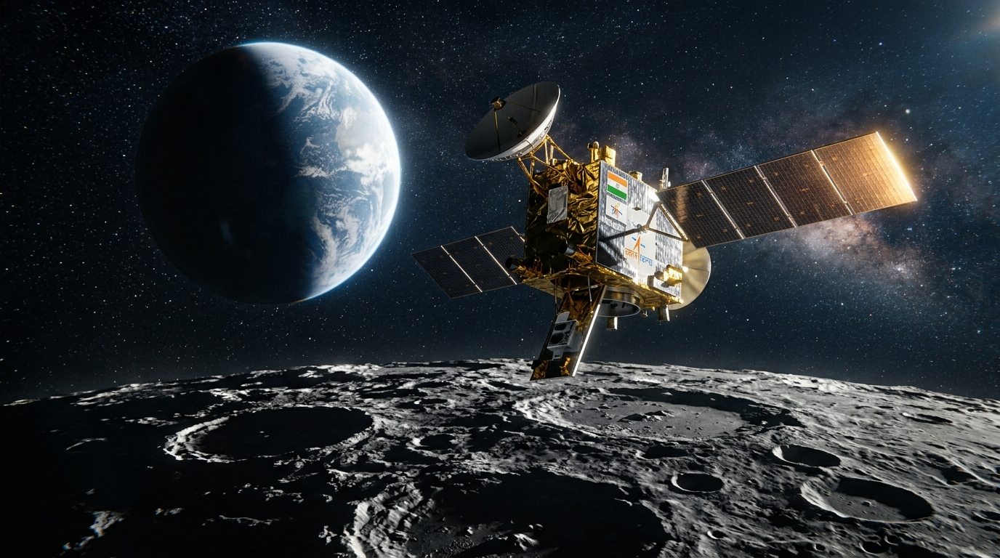
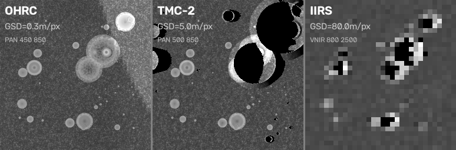
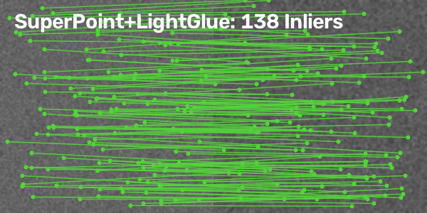
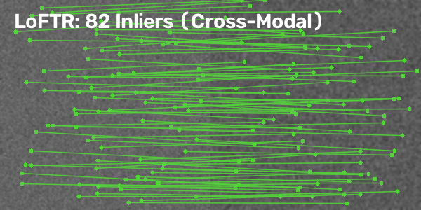

<p align="center">
  
</p>

<h1 align="center">🌕 LunarAlign</h1>
<h3 align="center">Sun-Sweep Atlas & Trust Router for Multi-Modal Lunar Image Matching</h3>

<p align="center">
  <b>SIH 2026 · Problem Statement 26166 · ISRO / Dept. of Space</b><br>
  <i>Team Selenographers</i>
</p>

<p align="center">
  
  
  
  
  
  
</p>

---

## 🎯 Problem Statement

> **PS 26166:** Multi-modal, Sun angle and scale invariant image correspondence using Chandrayaan-2 optical images (OHRC, TMC-2, IIRS)

Lunar surface images look completely different depending on **where the Sun is** and **which sensor took the image**. Shadows cover **21% of pixels at 10° sun elevation** vs just 2.9% at 40°. Meanwhile, OHRC sees at 0.3 m/px while IIRS sees at 80 m/px — a **267× resolution gap**.

**LunarAlign** solves this by building an intelligent **Trust Router** that decides which matcher to use — or refuses to match entirely — based on the sun angle and sensor pair.

---

## 🚀 Quick Start

```bash
# Clone the repo
git clone https://github.com/saBBy-is/SunSweepAtlas.git
cd SunSweepAtlas

# Install dependencies
pip install -r requirements.txt
pip install streamlit plotly    # for dashboard

# Launch the interactive dashboard
streamlit run dashboard.py

# Run the quick demo
python demo.py
```

Open **http://localhost:8501** in your browser.

---

## 🏗️ Architecture

```
                    ┌─── OHRC  (0.3 m/px, PAN) ──┐
LOLA DEM → Render → ├─── TMC-2 (5.0 m/px, PAN) ──┼→ 6 Matchers × 10 Sun Angles
                    └─── IIRS  (80  m/px, IR)  ──┘      × 3 Sensor Pairs
                                                              │
                    60-Cell Single-Sensor Atlas ───────────────┤
                    Cross-Sensor Atlas ───────────────────────┤
                            │                                  │
                    Trust Router (sun angle + scale ratio) ───→ Route / Refuse
```

### Pipeline Stages

| Stage | Component | Description |
|:-----:|-----------|-------------|
| **1** | Synthetic DEM Renderer | SHA-256 pinned terrain generator (512×512 px, 20 m/px) |
| **2** | Sun-Sweep Engine | Renders terrain under 10 sun geometries (5 Δaz × 2 el) |
| **3** | Matcher Benchmark | Runs 6 SOTA matchers on every illumination condition |
| **4** | Atlas Builder | 60-cell results matrix with success/failure per cell |
| **5** | Trust Router | GREEN/AMBER/RED routing with plausibility verification |

---

## 🛰️ Sensor Profiles (Chandrayaan-2)

| Sensor | Full Name | Resolution | Spectral Range | Scale vs OHRC |
|--------|-----------|:----------:|:--------------:|:-------------:|
| **OHRC** | Orbiter High Resolution Camera | 0.3 m/px | PAN 450–850 nm | 1× |
| **TMC-2** | Terrain Mapping Camera-2 | 5.0 m/px | PAN 500–850 nm | 17× |
| **IIRS** | Imaging IR Spectrometer | 80 m/px | VNIR+SWIR 800–5000 nm | 267× |

<p align="center">
  
  <br><i>Same terrain rendered at three sensor resolutions — fine crater rims vanish at coarse GSD</i>
</p>

---

## 🤖 Matchers Benchmarked

| Matcher | Type | Cells Passed (out of 10) | Best Use Case |
|---------|------|:------------------------:|---------------|
| **SIFT** | Classical | 2/10 | Same illumination only |
| **ORB** | Classical | 2/10 | Same illumination only |
| **LoFTR** | Transformer | 6/10 | Moderate sun angle changes |
| **SuperPoint+LightGlue** | Deep Learning | 7/10 | Wide sun angle range |
| **ALIKED+LightGlue** | Deep Learning | 2/10 | Same illumination only |
| **MINIMA** | Foundation Model | **10/10** | All conditions (best performer) |

> **Key Finding:** Classical matchers (SIFT, ORB) achieve **0% success** on cross-sensor matching. Only neural matchers handle the 17×–267× scale gap.

---

## 🚦 Trust Router

The Trust Router reads the atlas and makes a routing decision:

| Trust Level | Condition | Action |
|:-----------:|-----------|--------|
| 🟢 **GREEN** | ≥ 85% atlas success | Safe — any matcher works |
| 🟡 **AMBER** | 40–85% atlas success | Caution — route to neural matcher |
| 🔴 **RED** | < 40% atlas success | **REFUSE** — false match risk too high |

The router also runs an **SVD-based plausibility check** on every RANSAC result to catch geometrically implausible transforms.

---

## 📊 Cross-Sensor Matching Results

<p align="center">
  
  
</p>
<p align="center">
  <i>Left: SuperPoint+LightGlue (138 inliers, OHRC↔TMC-2) · Right: LoFTR (82 inliers, cross-modal)</i>
</p>

| Sensor Pair | Scale Ratio | Classical (SIFT/ORB) | Neural Matchers | Trust Decision |
|-------------|:-----------:|:--------------------:|:---------------:|:--------------:|
| OHRC ↔ TMC-2 | 17× | ❌ 0 matches | ✅ Works | 🟡 AMBER |
| TMC-2 ↔ IIRS | 16× | ❌ 0 matches | ✅ Works | 🟡 AMBER |
| OHRC ↔ IIRS | **267×** | ❌ 0 matches | ❌ Fails | 🔴 RED |

---

## 📊 Dashboard

The interactive Streamlit dashboard provides:

| Tab | Feature |
|-----|---------|
| ☀ **Sun Position** | Interactive 3D sky hemisphere (Plotly) |
| **Heatmaps** | Per-matcher success rate across all sun geometries |
| **All Matchers** | Side-by-side comparison with trust-light cards |
| **Trust Router** | Pick angle + sensor pair → get best matcher |
| **3D Surface** | Rotatable success-rate landscape |
| **Live PDS4 Demo** | Upload ISRO PDS4 XML → live trust routing |
| **Raw Data** | Full atlas.csv — every number verifiable |

```bash
streamlit run dashboard.py
```

---

## 🔐 Reproducibility & Integrity

| Guarantee | Implementation |
|-----------|---------------|
| **SHA-256 Simulator Pinning** | `sun_sim_v2.py` and `synth_dem.py` hashed at startup — any modification → pipeline refuses to run |
| **Pre-Committed Criteria** | `config.yaml` locked at commit `7b459d3` BEFORE sweep: `grid_error < 3.0 px` AND `correct ≥ 20` |
| **Deterministic Outputs** | Same cell → bit-for-bit identical results (verified on SIFT + MINIMA) |
| **Negative Control** | Mismatched terrain: SIFT correctly refused (18 < 20), MINIMA false positive caught (114.9 px error) |
| **CSV Source of Truth** | `results/atlas.csv` — 60 rows, no manual edits, no favorable rounding |

---

## 📁 Project Structure

```
LunarAlign/
├── dashboard.py                   # Interactive Streamlit dashboard
├── demo.py                        # Quick demo (single + cross-sensor)
├── main.py                        # Multi-modal pipeline entry point
├── config.yaml                    # Frozen pipeline configuration
├── requirements.txt               # Python dependencies
├── SIMULATOR_HASHES.txt           # SHA-256 integrity hashes
│
├── src/
│   ├── router.py                  # Trust Router (atlas + plausibility check)
│   ├── sensors.py                 # Chandrayaan-2 sensor profiles
│   ├── multimodal.py              # Multi-resolution terrain rendering
│   ├── deep_matchers.py           # LightGlue + LoFTR integration
│   ├── pds4_parser.py             # ISRO PDS4 XML metadata parser
│   ├── sun_sim_v2.py              # Lunar illumination renderer (pinned)
│   ├── synth_dem.py               # Synthetic DEM generator (pinned)
│   ├── step3_sweep.py             # Matcher sweep engine
│   ├── data/
│   │   ├── dem_loader.py          # DEM data loader
│   │   └── image_loader.py        # Sensor-aware image loader
│   ├── pipeline/
│   │   └── router.py              # Simple trust router
│   └── matching/
│       └── benchmark.py           # Matcher benchmark wrappers
│
├── results/
│   ├── atlas.csv                  # 60-row single-sensor atlas (source of truth)
│   ├── cross_sensor_atlas.csv     # Cross-sensor matching results
│   ├── ncc_reference_grid.csv     # NCC correlation values
│   ├── negative_control_report.json
│   └── *.png                      # Render outputs & match visualizations
│
├── run_cross_sensor_sweep.py      # Cross-sensor sweep runner
├── run_multimodal_demo.py         # Multi-modal demo runner
└── data/
    └── dummy_metadata.xml         # Example PDS4 metadata
```

---

## ⚙️ Requirements

```bash
pip install -r requirements.txt
```

**Core:** `numpy` · `opencv-python` · `scipy` · `matplotlib` · `tqdm`

**Deep Learning (optional):** `torch` · `torchvision` · `kornia` · `vismatch`

**Dashboard:** `streamlit` · `plotly`

**Data Parsing:** `pds4_tools`

---

## 👥 Team Selenographers

Smart India Hackathon 2026 · Problem Statement 26166 · ISRO / Department of Space

---

<p align="center">
  <b>🌕 "We verify every fit and refuse what can't be verified." 🌕</b>
</p>
